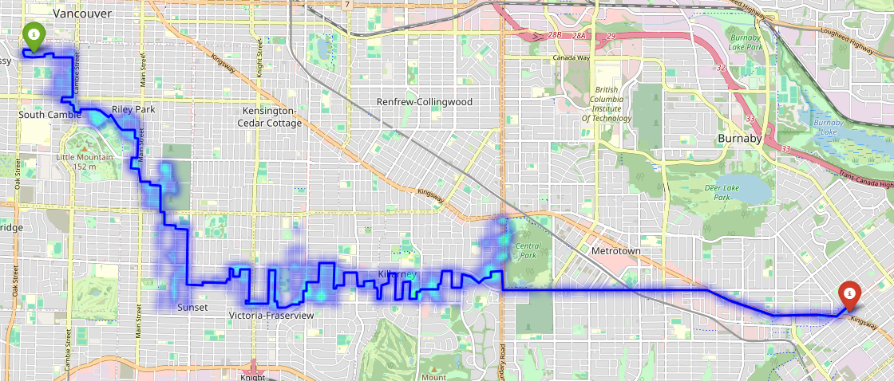

# HeuristicSearch
Different Search Strategies implemented with a Heuristic Over Crime Data

## Key Components

### Adaptive Multivariate Heuristic Function

The heuristic is implemented with crime data from the city vancouver.
```
h(u, v) = (d_geo(c(u), c(v))/d_max) × w₁ + (|P(c(u), r)| + |P(c(v), r)|) × w₂
```

Where:
- **h(u, v)**: Cost estimation between nodes _u_ and _v_
- **d_geo(c(u), c(v))**: Geodesic distance (Haversine) between coordinates
- **d_max**: Normalization factor (maximum pairwise distance in dataset)
- **|P(c(u), r)|**: Cardinality of points within radius _r_ (density metric)
- **w₁, w₂**: Tunable hyperparameters balancing distance vs. density

### Hyperparameter Configuration
The current implementation utilizes empirically optimized weights:
```python
w₁ = 10  # Geodesic component weight
w₂ = 90  # Density component weight
```
This configuration prioritizes node density analysis while maintaining geospatial awareness, creating an effective exploration-exploitation balance.

## Performance Benchmarking
Comparative analysis of search algorithms under identical environmental conditions:

| Algorithm                 | Time Taken (s) | Memory Used (MB) |
|---------------------------|-------------------------|------------------------|
| Greedy Best-First Search  | 2.2625                  | 5317.78                |
| A* Search                 | 1.5606                  | 5317.78                |
| Weighted A* Search        | 2.5806                  | 5317.78                |

**A*** demonstrates Time efficiency, although all of them tend to use around the same amount of memory, this can be due to implementation.

## Heatmap of Potiential Paths

